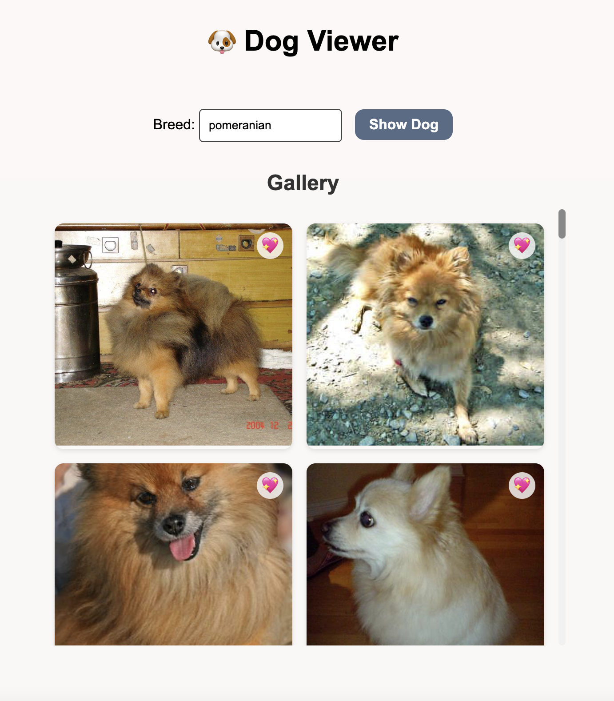

# 🐶 Random Dog Viewer

A fun and lightweight front-end project that displays random dog images using the [Dog CEO API](https://dog.ceo/dog-api/).

## 🚀 Features

- Fetches a random dog image on button click
- Uses `async/await` for API calls
- Dynamically updates the DOM
- Responsive and clean UI with minimal styling

## 🛠️ Tech Stack

- HTML
- CSS
- JavaScript (Vanilla)

## 📸 Demo



## 📂 Getting Started

To run the project locally:

```bash
git clone https://github.com/yourusername/random-dog-viewer.git
cd random-dog-viewer
open index.html
